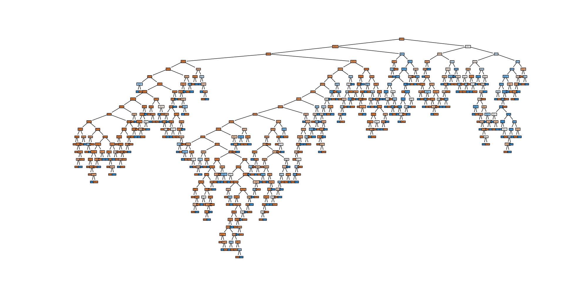

# PRODIGY_DS_03

# Bank Marketing Prediction Project

## Problem Definition
The goal of this project is to predict whether a customer will purchase a product or service based on their demographic and behavioral data. This is a classification problem where we aim to help businesses target potential customers more effectively.

## Dataset
The dataset used for this project is the [Bank Marketing dataset](https://archive.ics.uci.edu/ml/datasets/Bank+Marketing) from the UCI Machine Learning Repository.

## Results
- The decision tree classifier achieved an overall accuracy of approximately 88.84% on the test dataset.
- Precision and recall metrics were analyzed for both classes ("no" - customers who didn't purchase, "yes" - customers who purchased).
- Further details on the project and results can be found in the Jupyter Notebook.

## Decision Tree Classifier Visualization

